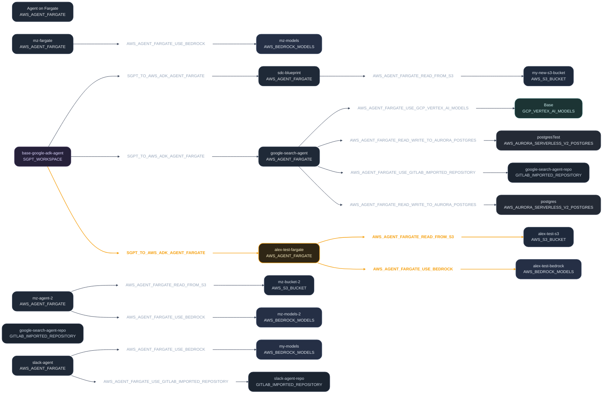

# Deletion Strategy
```csharp
public sealed class DeletionStrategy(IDependencyGraphResolver graphResolver,
                                     IDeletionPlanner deletionPlanner,
                                     IDeletionPlanExecutor deletionExecutor)
    : IDeletionOrchestrationStrategy
{
    public async Task<DeletionPlan> ExecuteAsync(DeleteDependencyRequest request,
                                                 CancellationToken cancellationToken)
    {
        // STEP 1 — Resolve Graph
        var graph = await graphResolver.ResolveAsync(request.RootIds, cancellationToken).ConfigureAwait(false);

        // STEP 2 — Create Plan
        var deletionPlan = deletionPlanner.CreatePlan(graph);

        // STEP 3 — Execute Plan
        await deletionExecutor.ExecuteAsync(deletionPlan, cancellationToken).ConfigureAwait(false);

        return plan;
    }
}
```

# Specific Deletion
```csharp
public interface IDeleteGraphItem
{
    bool CanHandle(GraphItem item);

    Task DeleteAsync(GraphItem item,
                     CancellationToken cancellationToken);
}


public sealed class DeleteAwsBedrockModel : IDeleteCapability
{
    public bool CanHandle(CapabilityType type)
        => type == CapabilityType.AwsBedrockModel;

    public Task DeleteAsync(DeletionNode node,
                            CancellationToken cancellationToken)
    {
        Console.WriteLine($"Deleting Bedrock Model {node.Id}");
        return Task.CompletedTask;
    }
}
```


# 🧪 Canvas Report

## 📋 Overview

| Affected Element | Type | Stage | ID |
|------------------|------|-------|-----|
| alex-test-fargate | AWS_AGENT_FARGATE | Workbench | `a9a8bde0-42d9-43a0-905d-5d5831b7e2e7` |


## 📊 Canvas Changes Diagram




## 📊 Impact Summary

| Entity | Affected | Marked | Deleted |
|--------|----------|--------|---------|
| Capabilities | 1 | 1 | 0 |
| Relations | 3 | 3 | 0 |
| Nodes | 1 | 1 | 0 |
| Edges | 3 | 3 | 0 |

## 🟡 Affected Capabilities (1)

| Name | Type | ID |
|------|------|----|
| alex-test-fargate | AWS_AGENT_FARGATE | `a9a8bde0...` |

## 🟡 Affected Relations (3)

| Type | Source → Target |
|------|-----------------|
| AWS_AGENT_FARGATE_READ_FROM_S3 | alex-test-fargate → alex-test-s3 |
| AWS_AGENT_FARGATE_USE_BEDROCK | alex-test-fargate → alex-test-bedrock |
| SGPT_TO_AWS_ADK_AGENT_FARGATE | base-google-adk-agent → alex-test-fargate |

## 🟡 Affected Nodes (1)

| Capability | Type |
|------------|------|
| alex-test-fargate | AWS_AGENT_FARGATE |

## 🟡 Affected Edges (3)

| Type | Source → Target |
|------|-----------------|
| AWS_AGENT_FARGATE_READ_FROM_S3 | alex-test-fargate → alex-test-s3 |
| SGPT_TO_AWS_ADK_AGENT_FARGATE | base-google-adk-agent → alex-test-fargate |
| AWS_AGENT_FARGATE_USE_BEDROCK | alex-test-fargate → alex-test-bedrock |


## 📈 Statistics

- **Capabilities**: 25 → 25
- **Relations**: 15 → 15
- **Nodes**: 21 → 21 (0 added, 0 deleted, 1 changed, 1 marked)
- **Edges**: 15 → 15 (0 added, 0 deleted, 3 changed, 3 marked)

## 🎨 Color Legend

- 🟢 **Green** - Added (new entities)
- 🟡 **Yellow** - Marked for Deletion (will be deleted on next deploy)
- 🟠 **Orange** - Changed (modified entities)
- 🔴 **Red** - Deleted (no longer exists)
- ⚪ **White** - Unchanged
